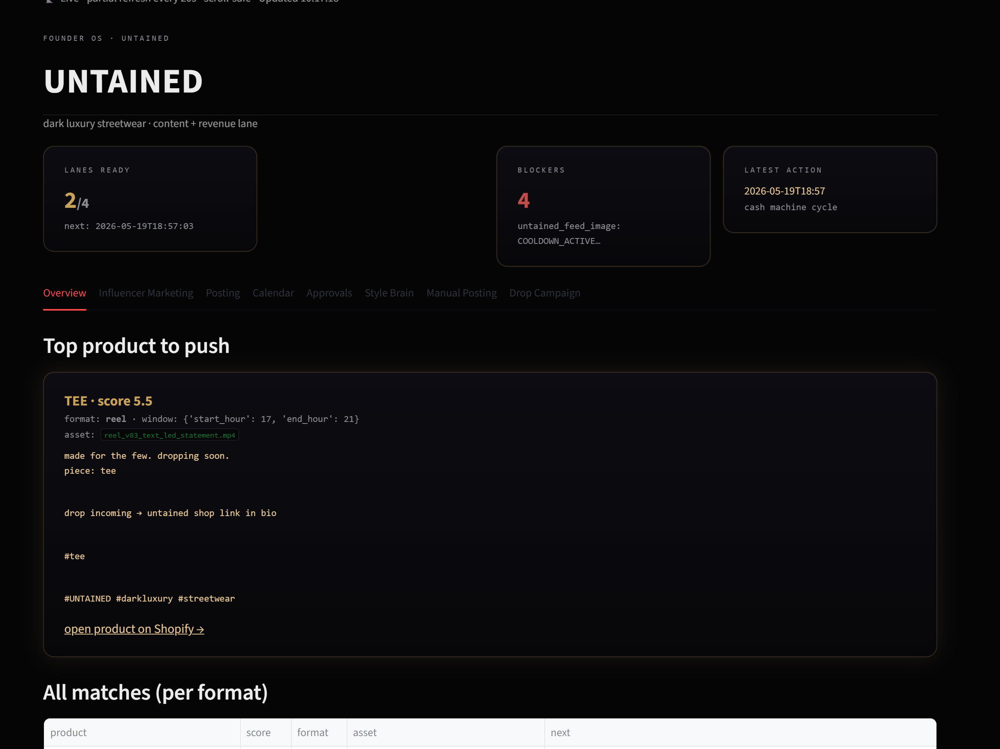
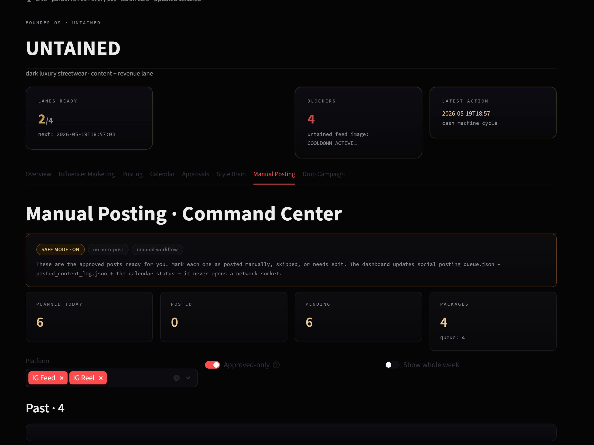

# AI Content Ops Pipeline

   -blue)

> A local-AI content pipeline for my clothing brand **UNTAINED**: local-LLM ideation → automated reel/image generation (FFmpeg + TTS) → a filesystem state machine → a posting workflow that **defaults to manual approval and never auto-posts**. $0 paid APIs.

> ℹ️ Personal-brand scale. No fabricated metrics, testimonials, or revenue. **Cleaned, representative subset** of a larger private system.



## Why this exists

Running a brand solo means the content treadmill never stops: ideate → edit →
caption → schedule → review → post. This automates the repetitive parts while
keeping a human at the one step that matters — approving a post.

## How it works

```
ideation (Ollama, local) → render (FFmpeg + TTS + overlays) → review/score
→ 07_READY_TO_POST → posting_safety (SAFE MODE) → manual approve → 08_POSTED → analytics
```

See [`docs/architecture.md`](docs/architecture.md) · [`docs/safety_model.md`](docs/safety_model.md).

## Repository layout

```
src/         ideation_agent · render_pipeline · posting_safety · pipeline_state
docs/        architecture · safety_model
configs/     pipeline_config.example.yaml
demo_data/   sanitized content queue + post log
examples/    generate_one_reel.py
assets/      dashboard screenshots + architecture diagram
```

## Quickstart

```bash
pip install -r requirements.txt
python examples/generate_one_reel.py   # ideate + (mock) render + queue for MANUAL approval — nothing is posted
```

## Posting safety (the important part)



`posting_safety.py` defaults to **SAFE MODE**: it updates local queue/log/calendar
files and *never opens a network socket*. Publishing needs `safe_mode=False`
**plus** a per-platform unlock — otherwise publishers refuse.

## Tech

Python · Ollama (local LLM) · FFmpeg / OpenCV / PIL · local TTS (paid optional behind a flag) · Streamlit · $0 paid APIs.

## License

MIT — see [LICENSE](LICENSE).
