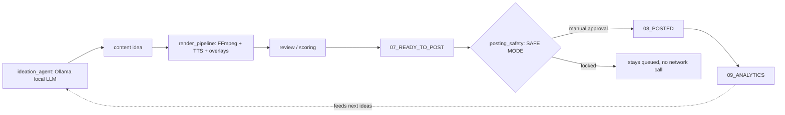
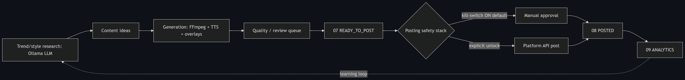

# Architecture — AI Content Ops Pipeline

> Representative/cleaned subset. Local-first, $0 paid APIs. Personal-brand scale.

## Flow

## Modules in this showcase

| File | Responsibility |
| --- | --- |
| `src/ideation_agent.py` | Local-LLM (Ollama) idea generation with a clean fallback |
| `src/render_pipeline.py` | Builds the FFmpeg/TTS render spec for a vertical reel |
| `src/posting_safety.py` | SAFE-MODE gate: manual approval, never auto-posts |
| `src/pipeline_state.py` | The numbered-folder state machine + legal transitions |

## The filesystem state machine

`01_RAW_FOOTAGE → 05_READY_TO_EDIT → 06_FINISHED_VIDEOS → 07_READY_TO_POST → 08_POSTED → 09_ANALYTICS`

Each stage is a folder; moves are forward-only and one step at a time. Benefits:
crash-safe, totally transparent ("where is this asset?" is just "which folder"),
no database to corrupt.

## Not in this subset

Live platform publishers, the Streamlit operator dashboard, Shopify sync, and
the analytics learning loop are summarized here and shown in screenshots, but
kept out of the public code.
